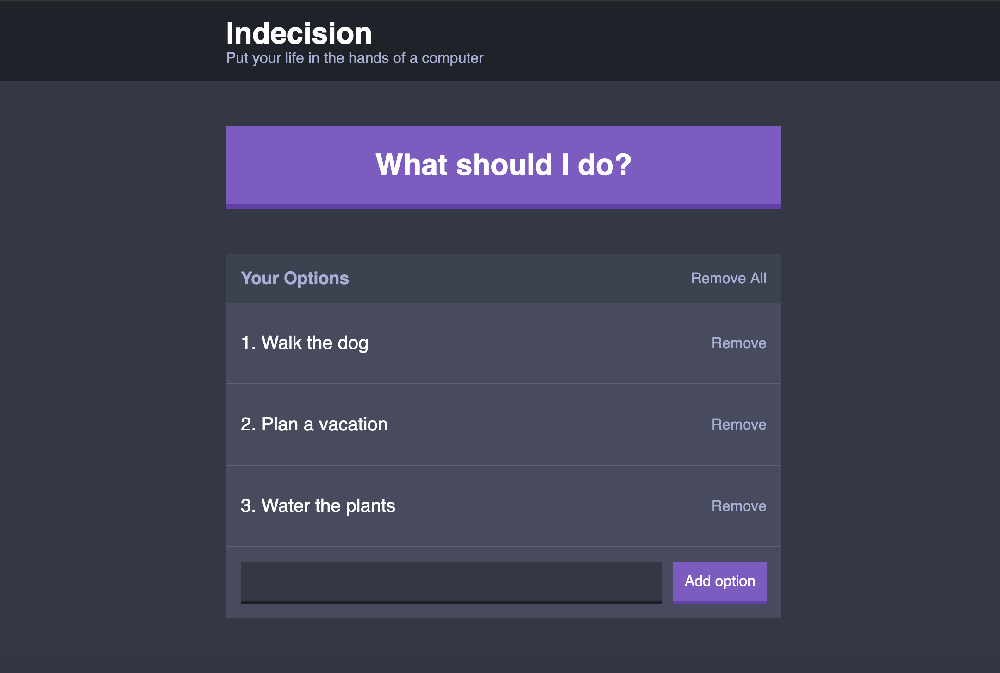

# Indecision Application

Let the application choose the next task for you. Add all your tasks and click on the "What should I do?" button to find out which task you should complete first.
The Indecision application was written with React.

## Demo

[Click here](https://langer-react-indecision-app.herokuapp.com/) for a working live demo.

## Screenshots

## Installation

Clone this repo and in the project directory run `yarn install` to install all the dependencies.

## Build

The application use a custom Webpack configuration. The build commands for development and production generate the `bundle.js` file.

### Development Build
In the project directory run `yarn run build:dev` to build the project.

### Production Build
In the project directory run `yarn run build:prod` to build the project.

## Usage

In the project directory run `yarn run start` to start the application. You should now be able to access it from `http://127.0.0.1:<PORT>/`. If you didn't confiugred the PORT environment variable, the default port is 3000.

## Credits

This application was written as part of Andrew Mead's "The Complete React Developer Course" course.